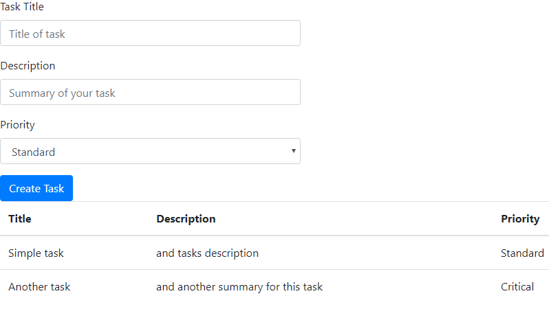

# Using a nice HTML Form with REST API

In this exercise we are developing a simple web form for creating and listing user's task. We use bootstrap on client side. Additionally we look at 'Morgan' module.

## Prerequistes

npm i --save-dev express morgan lodash body-parser

