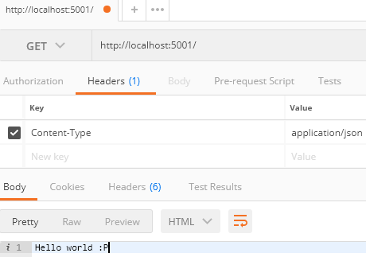
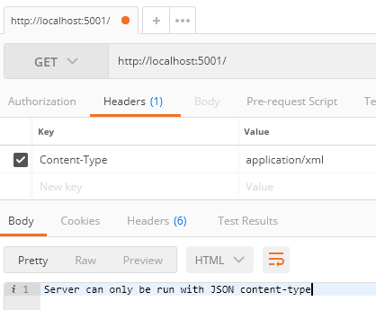
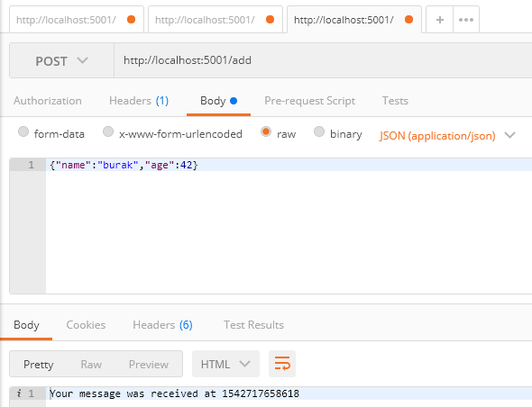
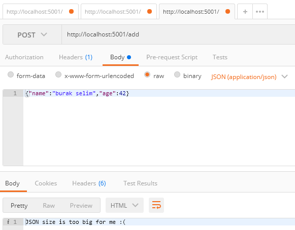

#Understanding and writing middleware functions/modules

This demonstration required following modules...

```
npm i --save-dev express
```

###Test for controller.js middleware

Valid content-type



Not valid content-type



###Test for bodySizeController

Valid size



Invalid size

